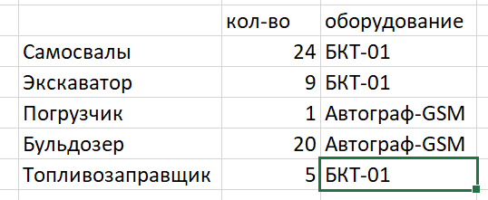

# carrier-firmware

Данный репозиторий содержит исходный код программы сбора и передачи телеметрической информации карьерной техники для контроллера БКТ-01 (устройство на базе процессора TI AM335x Sitara, armv7hf).

Для каждой конфигурации прошивки под свой тип техники определенно название:

* dmp -- самосвалы (dump trucks)
* ful -- автозаправщики (fuelers)
* shv -- экскаваторы (shovels)



## Структура проекта

В качестве основы программной архитектуры проекта используется принцип "портов и адаптеров" ([подробнее](https://herbertograca.com/2017/11/16/explicit-architecture-01-ddd-hexagonal-onion-clean-cqrs-how-i-put-it-all-together/)).

Каждая конкретная прошивка (aux, dmp, etc.) формирует вертикальный разрез и является полностью абстрагированной от любой другой ([подробнее](https://jimmybogard.com/vertical-slice-architecture/)).

### 0 `run` -- входные точки конфигураций (composition roots)

Проекты данного уровня осуществляют инициализацию компонентов и настройку интеграций между ними.

## Сборка проекта

Debug-сборка проекта происходит по средствам кросс-компиляции.

### Пакетный менеджер conan

1. Активировать SDK среду

```sh
source ./{PATH_TO_SDK}/envierment-setup
```

2. Добавить conan профиль

```sh
conan profile new sitara
```

3. Внести изменения в конфигурацию профиля

```toml
[settings]
arch=armv7hf
arch_build=x86_64
build_type=Release
compiler=gcc
compiler.libcxx=libstdc++11
compiler.version=7.2
os=Linux
os_build=Linux
```

4. Собрать зависимости

```sh
conan install . --profile sitara --build
```

### Работа из под Windows

Для работы над проектом из под `Windows 10/11` необходимо включить модуль `WSL2` и установить подходящий дистрибутив (например, `Ubuntu 20.04` из Windows Store). Для запуска `QtCreator` потребуется `gWSL/WSLg`.

## Дополнительные материалы

[Processor SDK Linux for AM335X](http://software-dl.ti.com/processor-sdk-linux/esd/docs/latest/devices/AM335X/linux/index.html)