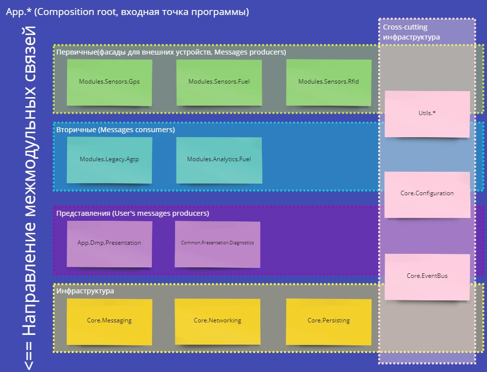

# KbAis.OpenPit.Firmware

## Описание

Данный репозиторий содержит исходный код программы по сбору, обработки и передачи телеметрической информации карьерной техники контроллера БКТ-01 (одноплатный компьютер на базе процессора TI AM335x, [спецификация](https://www.ti.com/product/AM3352)).

Для каждой конфигурации прошивки под свой тип техники определенно краткое название:

* DMP -- самосвалы (dump trucks)
* FUL -- автозаправщики (fuelers)
* SHV -- экскаваторы (shovels)

Проект использует стандарт C++17. Статус реализованных пунктов стандарта в GCC 7.2.1 можно узнать на [соответствующей](https://gcc.gnu.org/projects/cxx-status.html#cxx17) проекта.

## Сборка проекта

Проект собирается с помощью кросс-компиляции `GCC 7.2`. Целевой платформой является `linux-gnuebai` ARMv7. В настоящее время для сборки используется SDK Texas Instruments Arago версии 2018.10 (используемый в качестве основы для создания yocto-образов).

Для сборки необходим любой подходящий дистрибутив Linux, например, Ubuntu 20.04. Рекомендуется работать над проектом в IDE `Qt Creator`, [инструкция по настройке среды](https://software-dl.ti.com/processor-sdk-linux/esd/docs/latest/linux/Examples_and_Demos_Sub-system_Demos.html).

Сборка осуществляется при помощи `qmake` (интегрировано в `Qt Creator`). При переходе на последнее SDK планируется миграция на `cmake`.

В качестве пакетного менеджера используется `conan` с интеграцией `qmake`. Для получения и сборки зависимостей необходимо добавить следующий профиль:

```ini
[settings]
arch = armv7hf
arch_build = x86_64
build_type = Release
compiler = gcc
compiler.libcxx = libstdc++11
compiler.version = 7.2
os = Linux
os_build = Linux
```

После произвести сборки с помощью следующей команды:

```sh
conan install . --profile sitara --build
```

### Работа из под Windows 10/11

Для работы над проектом из под `Windows 10/11` необходимо включить модуль `WSL2` и установить подходящий дистрибутив Linux, например, `Ubuntu 20.04` из Windows Store. Для запуска `QtCreator` потребуется X11 сервер или любой врапер вокруг сервера оконного окружения: `gWSL` (Windows 10) или `WSLg` (Windows 11).

## Программная архитектура проекта

В качестве основы программной архитектуры проекта используется принцип "портов и адаптеров" ([подробнее](https://herbertograca.com/2017/11/16/explicit-architecture-01-ddd-hexagonal-onion-clean-cqrs-how-i-put-it-all-together/)). Используется принцип композиции, т.е. вышестоящие модули включаются в нижние и так далее, пока не соберется `composition root` во входной точке приложения.



Модуль каждой конкретная прошивка (AUX, DMP, FUL и т.д.) должен формировать собственный вертикальный разрез ([подробнее](https://jimmybogard.com/vertical-slice-architecture/)).

TBD

## Модули проекта

TBD

## Сторонние зависимости

### Core libraries

* [`di/1.2.0`](https://conan.io/center/di) -- библиотека для создания Dependency Injection графа приложения в compile-time, [docs](https://boost-ext.github.io/di/).

* [`plog/1.1.5`]() -- библиотека для логирования, поддерживает одновременную запись логов в файлы и стандартный вывод. Также позволяет создавать scoped-логеры, например, для записи в отдельные файлы.

* [`rxcpp/4.1.1`]() --библиотека реактивной модели программирования. Необходима для организации обмена сообщениями между модулями системы. Также при помощи механизма планировщиков позволяет просто выполнять параллельную работу как на одном и/или нескольких тредах.

### Supporting libraries

* [`cli11/2.1.2`]() -- библиотека для упрощения работы с входящими параметрами консольной строки. В настоящее время используется для определения глобального уровня строгости логгера.

* [`nlohmann_json/3.10.5`]() -- библиотека для работы с форматом `json`. Поддерживает работу с бинарными форматами, в частности с `MessagePack`, что необходимо для механизма кеширования сообщений внутри системы и их передачи на сервер обработки данных, [docs](https://json.nlohmann.me/).

* [`readerwriterqueue/1.0.5`]() -- библиотека для организации read-write очереди меду двумя тредами. Используется для передачи собранных сообщений в модуле `Core.Messaging` для кеширования в модуле `Core.Persisting`.

### Missing C++20 libraries

* [`expected-lite/0.5.0`]() -- используется для организации более чистого механизма обработки исключений.

* [`fmt/8.1.1`]() -- форматирование строк в более эффективной и удобной манере.

* [`range-v3/0.11.0`]() -- обеспечение семантики по работе с коллекциями в схожей манере с `dotnet/LINQ`.
